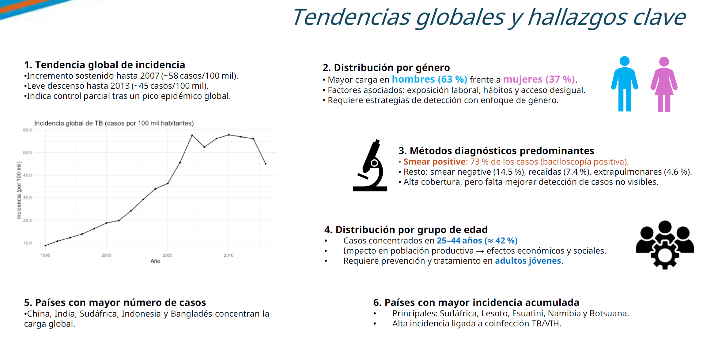
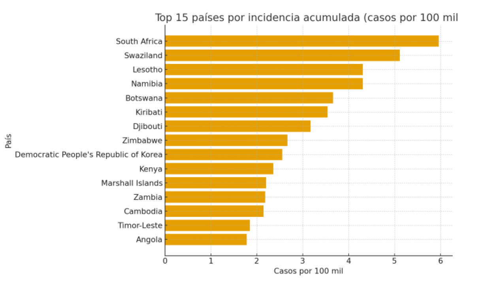

# Análisis Exploratorio de Tuberculosis (1995–2013) — Python

## Vista rápida

Proyecto de portafolio desarrollado en Python (Google Colab) para limpiar, integrar y analizar datos públicos de tuberculosis (TB) y población, con el fin de describir tendencias globales, distribución por género, grupo de edad y método diagnóstico.

**Repo:** https://github.com/mariafernandaglezmora-01/AED_Tuberculosis_python

---

## Entregables
- **Lámina resumen (PDF):** [lamina_tb.pdf](docs/report/lamina_tb.pdf)
- **Reporte ejecutivo (PDF):** [reporte_tb.pdf](docs/report/reporte_tb.pdf)
- **Proceso de limpieza (PDF exportado de Colab):** [limpieza_tb_colab.pdf](docs/report/limpieza_tb_colab.pdf)
- **Notebook (código):** [01_limpieza_tb.ipynb](notebooks/01_limpieza_tb.ipynb)

---

## Datos
- Dataset público de TB tipo `who` + tabla de población (`population`) (OMS/WHO; ejercicio académico).

---

## Metodología (resumen)
1. Carga de tablas `who` y `population`.
2. Limpieza:
   - corrección de valores faltantes (caso Namibia/“NA” en `iso2`).
   - estandarización de nulos y estructura.
3. Transformación a formato tidy:
   - `melt()` para pasar de columnas a filas.
   - derivación de variables: `genero`, `metodo`, `grupoedad`.
4. Integración:
   - `merge()` por `country` y `year`.
5. Cálculos principales:
   - agregaciones por género.
   - distribución por método diagnóstico.
   - distribución por grupos de edad.
   - tasa de incidencia global anual (casos por 100 mil habitantes).

---

## Hallazgos principales (resumen)
- La incidencia global aumenta hasta ~2007 (~58 casos/100 mil) y desciende hacia 2013 (~45/100 mil).
- Mayor carga en hombres (~63%) frente a mujeres (~37%).
- Predomina diagnóstico “smear positive” (~73%); el resto se distribuye entre smear negative, recaídas y extrapulmonar.
- Mayor concentración en edades 25–44 años (~42%).
- Países con mayor carga absoluta: China, India, Sudáfrica, Indonesia y Bangladés.
- Mayor incidencia ajustada por población en países del África Subsahariana, asociada a contextos TB/VIH y desigualdades estructurales.

---

## Herramientas
Python, Pandas, NumPy, Matplotlib/Seaborn, Plotly (opcional)

---

## Nota
Repositorio publicado con fines educativos y de portafolio. Los datos son de fuente pública y el contenido muestra capacidades de limpieza, análisis exploratorio y comunicación de resultados.

